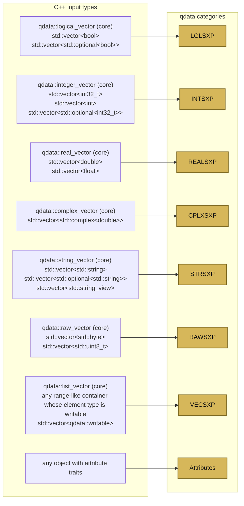

# qdata-cpp Spec

Spec for the standalone `qdata-cpp` object model and write traits.

## Namespaces

- `qdata::` : qdata-facing object types and write traits
- `io/` headers : shared low-level IO code used by qdata and qs2 formats

## Core read types

`qdata -> C++` maps to an exact owned C++ model, following R-style vector naming.

- `nil_value`
- `logical_vector`
- `integer_vector`
- `real_vector`
- `complex_vector`
- `string_vector`
- `raw_vector`
- `list_vector`
- `named_object`
- `object`

```cpp
namespace qdata {

struct nil_value {};

struct object;
struct named_object;

struct logical_vector {
    std::vector<int32_t> values; // 0 false, 1 true, INT32_MIN NA
    std::vector<box<named_object>> attrs;
};

struct integer_vector {
    std::vector<int32_t> values; // INT32_MIN reserved for NA
    std::vector<box<named_object>> attrs;
};

struct real_vector {
    std::vector<double> values;
    std::vector<box<named_object>> attrs;
};

struct complex_vector {
    std::vector<std::complex<double>> values;
    std::vector<box<named_object>> attrs;
};

struct string_vector {
    std::shared_ptr<const string_storage> storage;
    std::vector<string_ref> records;
    std::vector<box<named_object>> attrs;
};

struct raw_vector {
    std::vector<std::byte> values;
    std::vector<box<named_object>> attrs;
};

struct list_vector {
    std::vector<box<object>> values;
    std::vector<box<named_object>> attrs;
};

struct object {
    using data_type = std::variant<
        nil_value,
        logical_vector,
        integer_vector,
        real_vector,
        complex_vector,
        string_vector,
        raw_vector,
        list_vector
    >;

    data_type data;
};

struct named_object {
    std::string name;
    object data;
};

} // namespace qdata
```

`object` is a thin wrapper around `std::variant`. `qdata::get` mirrors `std::get` behavior for variant-style access. Example:

```cpp
object obj = read(myfile);
real_vector rvec = get<real_vector>(obj); // copies the real_vector active value out of obj
const real_vector& rvec_ref = get<real_vector>(obj); // reference to the underlying real_vector
real_vector rvec_moved = get<real_vector>(std::move(obj)); // moves the real_vector active value out of obj
```

### String Layout

- `string_storage` owns fixed allocations used to back deserialized string data.
- `string_vector::records` stores `payload_ptr + uint32_t size`, with `UINT32_MAX` as the `NA` sentinel.
- `string_vector` is array-like; `operator[]` and iterators yield `string_ref`.
- `string_ref` exposes `is_na()` and `view()`, and implicitly converts to `std::string_view`.
- That implicit conversion is lossy for `NA` and yields an empty view.

## Write-side traits

`C++ -> qdata` is more permissive than the read interface. It serializes directly from the source object whenever possible, and recurses naturally through nested containers.

The write side is organized around four ideas:

1. leaf traits map a C++ type to one non-list vector category
2. range-like (iterable and `size` method) containers recurse automatically as list vectors
3. attributes recurse automatically too, with names attached
4. heterogeneous nested values use a dedicated helper type that can either borrow or own

## Leaf traits

The leaf traits families are:

- `LGLSXP_traits<T>`
- `INTSXP_traits<T>`
- `REALSXP_traits<T>`
- `CPLXSXP_traits<T>`
- `STRSXP_traits<T>`
- `RAWSXP_traits<T>`

These are the traits a user specializes when a type serializes as a logical, integer, real, complex, string, or raw vector.

Each leaf traits family uses one of two access patterns:

1. direct
   - contiguous qdata-native memory
   - serialize directly from `data()`
2. elementwise
   - use `get(i)`
   - needed for cases like `std::vector<bool>`

Custom types plug in by specializing the matching traits class.

`VECSXP` is special. Public customization is available for leaf traits and attribute traits; list recursion happens automatically.

Direct memory example:

```cpp
template <class T>
struct INTSXP_traits;

template <>
struct INTSXP_traits<MyIntVector> {
    static constexpr bool direct = true;

    static size_t size(const MyIntVector& x) {
        // size of MyIntVector
    }
    static const int32_t* data(const MyIntVector& x) {
        // data pointer to underlying int32_t array
    }
};
```

Elementwise example:

```cpp
template <class T>
struct LGLSXP_traits;

template <>
struct LGLSXP_traits<MyBoolVector> {
    static constexpr bool direct = false;

    static size_t size(const MyBoolVector& x) {
        // size of MyBoolVector
    }
    static int32_t get(const MyBoolVector& x, size_t i) {
        // int32_t value at position i
        // 0 false, 1 true, INT32_MIN NA
    }
};
```

## String traits

String traits use `std::string_view` and an optional `is_na` member function if you want to emit `NA_character_` values.

The returned string view is UTF-8 and must remain valid until serialization finishes.

Example:

```cpp
template <>
struct STRSXP_traits<MyStringVector> {
    static size_t size(const MyStringVector& x) {
        // size of MyStringVector
    }
    static bool is_na(const MyStringVector& x, size_t i) {
        // Whether string at position i is NA_STRING
    }
    static std::string_view get(const MyStringVector& x, size_t i) {
        // a UTF-8 string view of a string at position i
    }
};
```

## Automatic list support

Any range-like type whose element type is itself writable serializes automatically as a qdata list.

In practice, that means the type exposes iteration and a known element count.

Leaf mappings take precedence over the generic list rule.

That means:

- `std::vector<int32_t>` stays an integer vector, because it has a leaf mapping
- `std::vector<MyIntVector>` becomes a qdata list automatically, once `MyIntVector` has `INTSXP_traits<MyIntVector>`
- `std::vector<std::vector<int32_t>>` becomes a qdata list automatically

## Heterogeneous nested values

For heterogeneous lists and heterogeneous attributes, the helper type is a single erased wrapper that can either borrow or own.

The helper type has the following signature:

```cpp
namespace qdata {

class serializer;

class writable {
public:
    const void* ptr;
    void (*write_fn)(serializer&, const void*);
    std::shared_ptr<const void> owner;

    template <class T>
    static writable ref(const T& x);

    template <class T>
    static writable own(T x);
};

} // namespace qdata
```

`ptr` points at the object being serialized. `write_fn` knows how to serialize the erased object. `owner` is empty for borrowed values and holds the owned object for `own(...)`.

For `ref(...)`, the referenced object and any borrowed data it exposes must remain alive until serialization finishes.

This gives one heterogeneous helper type for lists and attribute values.

Example:

```cpp
MyIntVector ints;
std::vector<double> reals{1.0, 2.0};

std::vector<qdata::writable> x = {
    qdata::writable::ref(ints),
    qdata::writable::own(std::vector<std::string>{"a", "b"}),
    qdata::writable::ref(reals)
};
```

The important point is that adding `INTSXP_traits<MyIntVector>` once automatically makes `MyIntVector` usable:

- by itself
- inside homogeneous nested containers like `std::vector<MyIntVector>`
- inside heterogeneous containers via `qdata::writable::ref(...)` or `qdata::writable::own(...)`


## Attribute traits

Attributes are conceptually a named list and use the same recursive machinery as list elements.

If a type has attributes, specialize with `has_attributes = true` and expose them by index.

```cpp
template <>
struct ATTRSXP_traits<MyAttributedVector> {
    static constexpr bool has_attributes = true;

    static size_t size(const MyAttributedVector& x) {
        // number of attributes
    }
    static std::string_view name(const MyAttributedVector& x, size_t i) {
        // attribute name at position i
    }

    static decltype(auto) get(const MyAttributedVector& x, size_t i) {
        // attribute value at position i
        // must itself be writable by qdata
    }
};
```

## Lists with attributes

A list with attributes is just an object with:

- range-like element iteration
- serializable elements
- attribute traits

Example:

```cpp
struct MyListWithAttrs {
    std::vector<MyIntVector> values;
    std::vector<std::string> attr_names;
    std::vector<qdata::writable> attr_values;

    auto begin() const { return values.begin(); }
    auto end() const { return values.end(); }
    auto size() const { return values.size(); }
};

template <>
struct ATTRSXP_traits<MyListWithAttrs> {
    static constexpr bool has_attributes = true;

    static size_t size(const MyListWithAttrs& x) {
        return x.attr_names.size();
    }
    static std::string_view name(const MyListWithAttrs& x, size_t i) {
        return x.attr_names[i];
    }
    static decltype(auto) get(const MyListWithAttrs& x, size_t i) {
        return x.attr_values[i];
    }
};
```

`MyListWithAttrs` serializes as a qdata list because it is range-like. Its attributes serialize through `ATTRSXP_traits<MyListWithAttrs>`.
`attr_names` and `attr_values` stay aligned by index.

## Built-in write support


